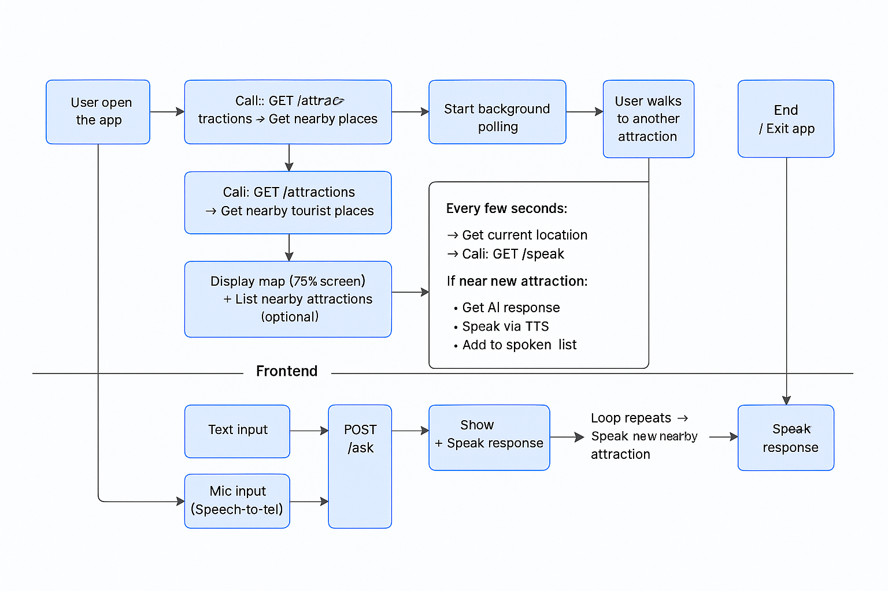

# 🤖 Tourio – AI-Powered Tour Guide

Automatically speaks fascinating facts as you approach nearby attractions — your personal AI tour guide that listens, talks, and navigates in real time.

---

## Inspiration

While traveling, I noticed many tourists using **pre-recorded audio guides**, where they had to manually press a number corresponding to a nearby attraction just to hear some information. It felt mechanical and disconnected from the actual experience of exploring.

I wanted to create something more natural — something that mimics a real tour guide. My goal was to **eliminate the need for pressing buttons** or following rigid instructions. That’s how the idea for **Tourio** was born:

> A smart, conversational tour guide that **automatically speaks** as you approach a landmark — making exploration feel personal, hands-free, and truly immersive.

---

## What it does

**Tourio** is a voice-driven tour companion that:

- **Automatically speaks** interesting facts when you're near a tourist attraction.
- **Shows nearby attractions** on a real-time map based on your location.
- **Listens to your queries** via voice or text input.
- **Responds with AI-generated answers** in a friendly, conversational tone.
- **Uses text-to-speech (TTS)** to narrate all important responses so you can enjoy a hands-free experience.

---

## How we built it

### Frontend (React Native + Expo)

- [`expo-maps`](https://docs.expo.dev/versions/latest/sdk/maps/) for the map interface with OpenStreetMap data.
- [`expo-location`](https://docs.expo.dev/versions/latest/sdk/location/) to track and update the user's location.
- [`expo-speech`](https://docs.expo.dev/versions/latest/sdk/speech/) for TTS responses.
- [`expo-speech-recognition`](https://docs.expo.dev/versions/latest/sdk/speech-recognition/) for converting speech input to text.
- [`react-native-webview`](https://github.com/react-native-webview/react-native-webview) for embedding the map.
- [`expo-router`](https://docs.expo.dev/router/introduction/) for navigation and routing.
- Axios/fetch for interacting with the backend.

### Backend (FastAPI)

- `/attractions`: Fetches nearby places using OpenStreetMap.
- `/explain`: Generates facts using LLAMA when a place is selected.
- `/speak`: Triggers automatic speech when approaching a new attraction.
- `/ask`: Accepts user questions and returns AI-generated answers.

### AI Layer

- Used **LLAMA** to generate friendly, informative, and concise narration for each attraction.

---

## Architecture

Tourio uses a modular architecture that combines real-time location tracking, voice interfaces, and LLM-based AI responses across a React Native frontend and a FastAPI backend.

The system is divided into two main layers:

### 1. Frontend (Mobile App – React Native with Expo)

- The app begins with an input screen for the user to enter a destination or place.
- It fetches the user's current location using `expo-location`.
- A live map interface (`expo-maps`) displays the user's position and nearby attractions.
- In the background, the app polls the backend every few seconds:
  - Calls the `/speak` endpoint with updated location data.
  - If a new nearby attraction is detected, the backend sends an AI-generated description, which is played using `expo-speech` (Text-to-Speech).
- Users interact with the AI guide via:
  - Text input, or
  - A mic button using speech-to-text.
- Input is sent to the `/ask` endpoint, and responses are both displayed and spoken aloud.
- The app tracks already "spoken" attractions to avoid repetition.

---

### 2. Backend (FastAPI)

- `/attractions` – Fetches nearby tourist spots using OpenStreetMap based on user’s GPS coordinates.
- `/explain` – Returns an AI-generated description of a specific place using the LLaMA model via Amazon Bedrock.
- `/speak` – Checks if the user is near a new, unspoken attraction. If so:
  - Generates a short, engaging summary.
  - Sends it to the frontend for playback.
  - Updates the list of spoken attractions.
- `/ask` – Handles user questions and returns responses using the LLaMA-powered AI chat system.

---

### Flow Summary

1. User opens the app and inputs a place.
2. The map interface appears with nearby attractions.
3. The app polls in the background:
   - Detects if the user is near a new attraction.
   - If yes, it automatically speaks about it.
4. The user can also ask questions by typing or speaking.
5. The app replies using AI and TTS, completing the interaction loop.

---

### System Architecture Diagram



---

This architecture enables a hands-free, real-time, and context-aware tour experience, closely mimicking a human tour guide with zero buttons to press once the journey starts.

---

## Challenges we ran into

- Handling accurate **GPS detection** and avoiding false triggers for nearby attractions.
- Integrating speech recognition, which required native modules and permissions.
- Synchronizing **real-time TTS** with dynamic responses without overlap or repetition.
- Managing **state and context** between attractions already spoken and new ones in the background.
- Debugging map interactions and microphone permissions across Android devices.

---

## Accomplishments that we're proud of

- Seamlessly blending **voice recognition**, **TTS**, **real-time maps**, and **AI** into one intuitive app.
- Creating a **completely hands-free experience** where users can just walk and learn.
- Keeping the system lightweight, **cost-free**, and API-key-free using OpenStreetMap and native device features.
- Crafting a natural-sounding guide powered by LLMs — making travel more immersive and educational.

---

## What we learned

- Deepened understanding of **React Native with native modules**, especially speech-to-text.
- Learned how to architect a **map-driven mobile app** with live user location tracking.
- Understood the importance of **minimizing distractions** in UX for travel-based apps.
- Gained experience in combining **voice interfaces**, **LLMs**, and **geolocation data** for real-world use cases.
- Explored the integration of **AWS Bedrock** to deliver scalable, low-latency access to foundation models like LLAMA for generating contextual tour guidance.

---

## What's next for Tourio – AI powered tour guide

- Add **multi-language support** for international tourists.
- Implement **personalized tour suggestions** based on interests or walking patterns.
- Enable **photo-based recognition** (point camera at monument to learn about it).
- Download **offline maps and narration** for remote travel areas.
- Collaborate with local tourism boards or heritage apps for verified data.

---

## Getting Started

1. **Install dependencies**

   ```bash
   npm install
   ```

2. **Start the app**

   ```bash
   npx expo start
   ```

3. **Run the backend**

   ```bash
   cd backend
   pip install -r requirements.txt
   uvicorn main:app --reload
   ```

4. **Configure API endpoint**

   - Update `API_BASE_URL` in [`app/tour.tsx`](app/tour.tsx) to point to your backend server if running locally.

---

## Learn more

- [Expo documentation](https://docs.expo.dev/)
- [FastAPI documentation](https://fastapi.tiangolo.com/)
- [OpenStreetMap Overpass API](https://overpass-api.de/)
- [React Native documentation](https://reactnative.dev/docs/getting-started)
- [AWS Bedrock documentation](https://aws.amazon.com/bedrock/)

---

## License

This project is licensed under the [MIT License](LICENSE).
